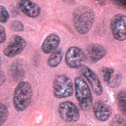
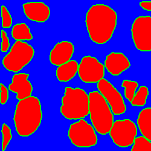

# Nuclei_Segmentation
This repository contains the pytorch code for the paper:  Improving Nuclei/Gland Instance Segmentation in Histopathology Images by Full Resolution Neural Network and Spatial Constrained Loss, MICCAI2019. ([pdf](https://link.springer.com/chapter/10.1007%2F978-3-030-32239-7_42))  

The code's original github([link](https://github.com/huiqu18/FullNet-varCE))  

### Data description
Before training, you need to prepare the training images and labels. The Data download ([link](https://nucleisegmentationbenchmark.weebly.com/dataset.html))
Note. The authors of the Multi-Organ dataset replaced some images in the dataset in September 2019. Therefore the current dataset is different from what I used for experiments. As a result, we put the original dataset ([here](https://drive.google.com/drive/folders/19ASx6rRvvTapp_W80oGLxNwoN8eLKTil?usp=sharing)) (Tissue Images and Annotations) for your reference. The color normalized images、instance labels and ternary labels are also included in the folder. 
| Image | Ternary label |
| ---|-----|
|  |  | 

## Usage

* For MultiOrgan dataset, generate the instance labels from the .xml annotation files. Use uint16 instead of 
uint8 to assign a unique integer for each nucleus.

* Generate the ternary label from each instance label using `create_ternary_labels` method in `prepare_data.py`.

* Compute the weight map from each instance label using `weight_map.m`.

* For MultiOrgan dataset, perform color normalization in all images to reduce the color variance using `color_norm` 
method in `prepare_data.py`.

* For MultiOrgan dataset, split each large training image/label/weight_map into 16 small 250x250 patches 
using `split_patches` method in `prepare_data.py`
